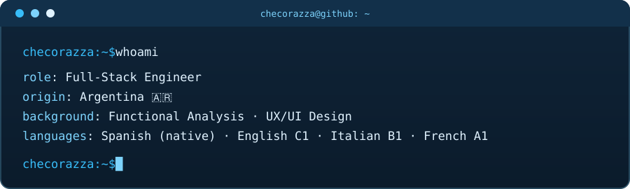

  <picture>
    <source media="(prefers-color-scheme: light)" srcset="./assets/whoami-light.svg">
    
  </picture>
  <picture>
    <source media="(prefers-color-scheme: light)" srcset="./assets/visual-map-light.svg">
    
  </picture>

<picture>
  <source media="(prefers-color-scheme: light)" srcset="https://img.shields.io/badge/C1-BAE6FD?&label=English&labelColor=0369A1&style=for-the-badge">
  
</picture>
<picture>
  <source media="(prefers-color-scheme: light)" srcset="https://img.shields.io/badge/Native-BAE6FD?&label=Spanish&labelColor=0369A1&style=for-the-badge">
  
</picture>
<picture>
  <source media="(prefers-color-scheme: light)" srcset="https://img.shields.io/badge/B1-BAE6FD?&label=Italian&labelColor=0369A1&style=for-the-badge">
  
</picture>
<picture>
  <source media="(prefers-color-scheme: light)" srcset="https://img.shields.io/badge/A1-BAE6FD?&label=French&labelColor=0369A1&style=for-the-badge">
  
</picture>

  <ul style="list-style: none">
    

      <h2>Skills</h2>
    

    ━━━━━━━━ ☆ ★ ☆ ━━━━━━━━
  </ul>

<pre>
<b>skills/</b>
├── <b>frontend/</b>
│   ├──  html5.html       # markup
│   ├──  css3.css         # styles
│   ├──  javascript.js   # language
│   ├──  typescript.ts   # language
│   └──  react.jsx        # library
├── <b>backend/</b>
│   ├──  python.py       # language
│   └──  flask.py        # framework
├── <b>database/</b>
│   └──  sqlite.db       # database
└── <b>design/</b>
    └──  figma.fig        # design tool
</pre>

<a href="https://www.github.com/checorazza">
  <picture>
    <source media="(prefers-color-scheme: light)" srcset="https://github-readme-stats-fast.vercel.app/api?username=checorazza&show_icons=true&theme=react&hide_border=false&hide_rank=false&include_all_commits=true&custom_title=Stats&bg_color=E0F2FE&border_color=38BDF8&title_color=0369A1&icon_color=0284C7&text_color=0B2A43">
    
  </picture>
</a>

<a href="https://www.github.com/checorazza">
  <picture>
    <source media="(prefers-color-scheme: light)" srcset="https://github-readme-stats-fast.vercel.app/api/top-langs/?username=checorazza&theme=react&hide_border=false&count_private=true&layout=compact&custom_title=Languages&langs_count=8&hide=dockerfile&size_weight=0.5&count_weight=0.5&bg_color=E0F2FE&border_color=38BDF8&title_color=0369A1&text_color=0B2A43">
    
  </picture>
</a>

<a href="https://git.io/streak-stats">
  <picture>
    <source media="(prefers-color-scheme: light)" srcset="https://github-readme-streak-stats-eight.vercel.app/?user=checorazza&theme=react&hide_border=true&background=E0F2FE&ring=0284C7&fire=0EA5E9&currStreakNum=0B2A43&sideNums=0B2A43&currStreakLabel=0369A1&sideLabels=0369A1&dates=0369A1">
    
  </picture>
</a>

━━━━━━━━ ☆ ★ ☆ ━━━━━━━━

